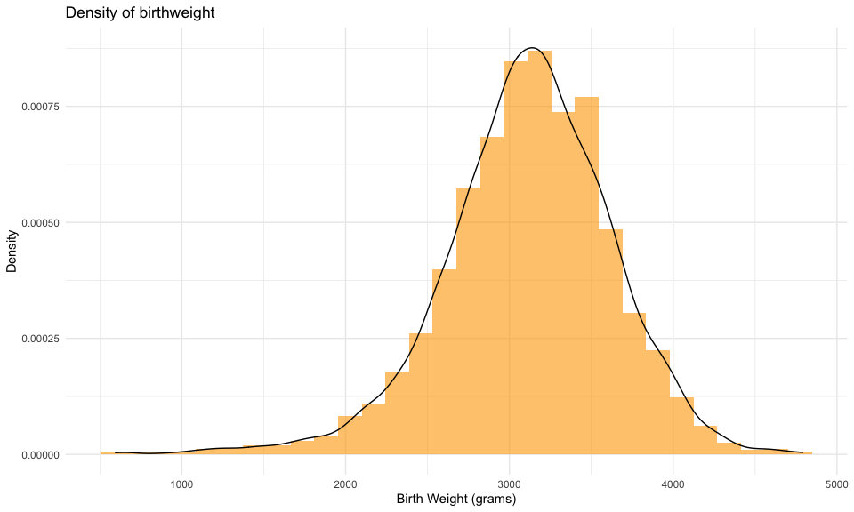
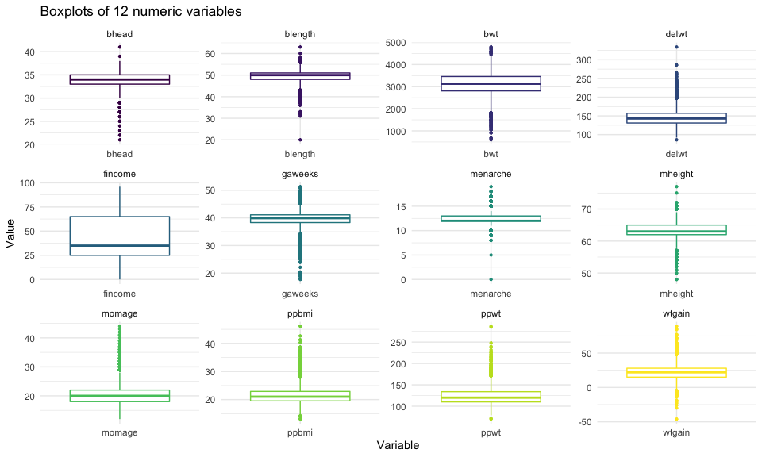
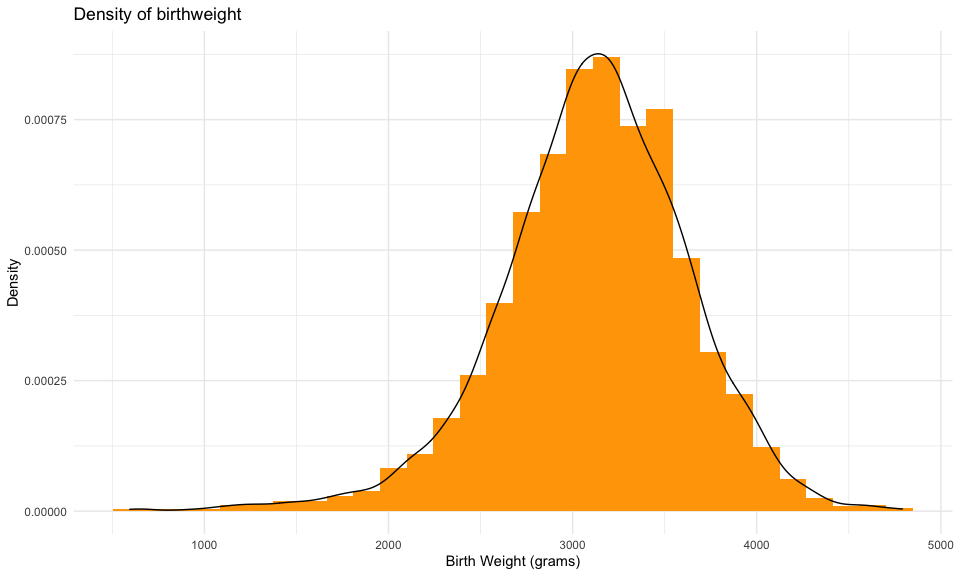
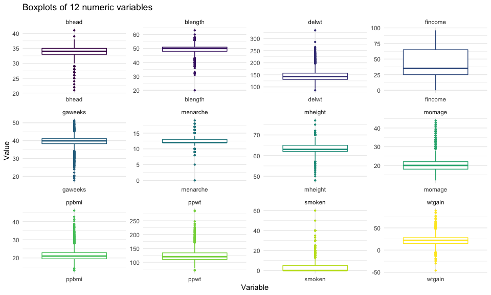
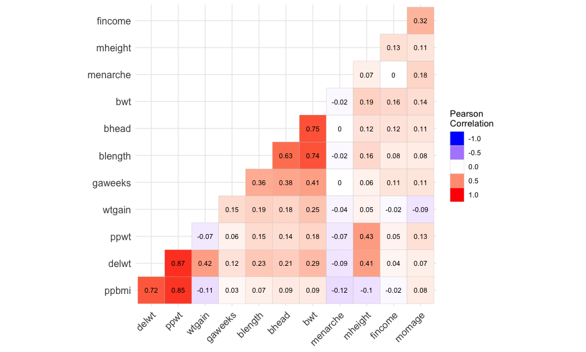

p8105\_hw6\_qw2331
================

## Problem 1

### 1.1 Load the data

``` r
baby_bwt_raw <- 
  read_csv("./data/birthweight.csv")
```

### 1.2 Clean the data

``` r
# Convert numeric to factor
race <- c("White", "Black", "Asian", "Puerto Rican", "Other", "Unkown")

baby_bwt_df <- 
  baby_bwt_raw %>% 
  mutate(
    babysex = factor(recode(babysex, `1` = "male", `2` = "female")),
    malform = factor(recode(malform, `0` = "absent", `1` = "present")),
    frace = factor(race[frace]),
    mrace = factor(race[mrace])
  ) %>% 
  distinct()

# Check missing values
baby_bwt_df %>% 
  is.na() %>% 
  colSums()
```

    ##  babysex    bhead  blength      bwt    delwt  fincome    frace  gaweeks 
    ##        0        0        0        0        0        0       14        0 
    ##  malform menarche  mheight   momage    mrace   parity  pnumlbw  pnumsga 
    ##        0        0        0        0        0        0        0        0 
    ##    ppbmi     ppwt   smoken   wtgain 
    ##        0        0        0        0

### 1.3 Propose a regression model

**1.3.1 Distribution of target variable `brithweight`**

``` r
baby_bwt_df %>% 
  ggplot(aes(bwt)) + 
  geom_histogram(aes(y = ..density..), fill = "orange") +
  geom_density(alpha = .4) + 
  labs(
    title = "Density of birthweight",
    x = "Birth Weight (grams)",
    y = "Density"
  )
```



**1.3.2 Summary statistics and check outliers**

``` r
# Check for missing values
# Or a brief data review using function str()
summary(baby_bwt_df)
```

    ##    babysex         bhead          blength           bwt           delwt      
    ##  female:2112   Min.   :21.00   Min.   :20.00   Min.   : 595   Min.   : 86.0  
    ##  male  :2230   1st Qu.:33.00   1st Qu.:48.00   1st Qu.:2807   1st Qu.:131.0  
    ##                Median :34.00   Median :50.00   Median :3132   Median :143.0  
    ##                Mean   :33.65   Mean   :49.75   Mean   :3114   Mean   :145.6  
    ##                3rd Qu.:35.00   3rd Qu.:51.00   3rd Qu.:3459   3rd Qu.:157.0  
    ##                Max.   :41.00   Max.   :63.00   Max.   :4791   Max.   :334.0  
    ##     fincome               frace         gaweeks         malform    
    ##  Min.   : 0.00   Asian       :  46   Min.   :17.70   absent :4327  
    ##  1st Qu.:25.00   Black       :1911   1st Qu.:38.30   present:  15  
    ##  Median :35.00   Puerto Rican: 248   Median :39.90                 
    ##  Mean   :44.11   White       :2123   Mean   :39.43                 
    ##  3rd Qu.:65.00   NA's        :  14   3rd Qu.:41.10                 
    ##  Max.   :96.00                       Max.   :51.30                 
    ##     menarche        mheight          momage              mrace     
    ##  Min.   : 0.00   Min.   :48.00   Min.   :12.0   Asian       :  43  
    ##  1st Qu.:12.00   1st Qu.:62.00   1st Qu.:18.0   Black       :1909  
    ##  Median :12.00   Median :63.00   Median :20.0   Puerto Rican: 243  
    ##  Mean   :12.51   Mean   :63.49   Mean   :20.3   White       :2147  
    ##  3rd Qu.:13.00   3rd Qu.:65.00   3rd Qu.:22.0                      
    ##  Max.   :19.00   Max.   :77.00   Max.   :44.0                      
    ##      parity            pnumlbw     pnumsga      ppbmi            ppwt      
    ##  Min.   :0.000000   Min.   :0   Min.   :0   Min.   :13.07   Min.   : 70.0  
    ##  1st Qu.:0.000000   1st Qu.:0   1st Qu.:0   1st Qu.:19.53   1st Qu.:110.0  
    ##  Median :0.000000   Median :0   Median :0   Median :21.03   Median :120.0  
    ##  Mean   :0.002303   Mean   :0   Mean   :0   Mean   :21.57   Mean   :123.5  
    ##  3rd Qu.:0.000000   3rd Qu.:0   3rd Qu.:0   3rd Qu.:22.91   3rd Qu.:134.0  
    ##  Max.   :6.000000   Max.   :0   Max.   :0   Max.   :46.10   Max.   :287.0  
    ##      smoken           wtgain      
    ##  Min.   : 0.000   Min.   :-46.00  
    ##  1st Qu.: 0.000   1st Qu.: 15.00  
    ##  Median : 0.000   Median : 22.00  
    ##  Mean   : 4.145   Mean   : 22.08  
    ##  3rd Qu.: 5.000   3rd Qu.: 28.00  
    ##  Max.   :60.000   Max.   : 89.00

``` r
# Check outliers using boxplots
pivotdata <- 
  baby_bwt_df %>% 
  select(2:6, 8, 10:12, 17:18, 20) %>% 
  pivot_longer(
    everything(),
    names_to = "variable",
    values_to = "value"
  )

pivotdata %>% 
  ggplot(aes(factor(variable), value)) + 
  geom_boxplot(
    aes(color = variable), 
    show.legend = FALSE, outlier.size = .8) + 
  facet_wrap(~variable, scale = "free") + 
  labs(
    title = "Boxplots of 12 numeric variables",
    x = "Variable",
    y = "Value"
  )
```



**1.3.3 Correlation Matrix**

``` r
# Create a correlation matrix
cordata <- 
  baby_bwt_df %>% 
  select(2:6, 8, 10:12, 17:18, 20) %>% 
  cor() %>% 
  round(3)

ggcorrplot::ggcorrplot(
  cordata, type = "lower", hc.order = TRUE, lab = TRUE, lab_size = 3) + 
  guides(
    fill = guide_legend(title = "Pearson\nCorrelation")
  )
```



**1.3.4 Fit a regression model and diagnostics**

``` r
# Fit a model
baby_bwt_df <- 
  baby_bwt_df %>% 
  select(babysex, bhead, blength, bwt, gaweeks)

mod1 <- lm(bwt ~ bhead + blength, data = baby_bwt_df)

# Present the output
mod1 %>% 
  broom::tidy() %>% 
  select(term, estimate, p.value) %>% 
  knitr::kable(digits = 3)
```

| term        |  estimate | p.value |
|:------------|----------:|--------:|
| (Intercept) | -6029.620 |       0 |
| bhead       |   146.021 |       0 |
| blength     |    85.030 |       0 |

``` r
# Diagnostics
# Residuals vs. Fits plot
res_fit_plot <-   
  baby_bwt_df %>% 
  add_residuals(mod1) %>% 
  add_predictions(mod1) %>% 
  ggplot(aes(x = pred, y = resid)) + 
  geom_point(size = 1.5, alpha = .4) + 
  geom_hline(yintercept = 0, linetype = "dotted") + 
  labs(
    title = "Residuals vs. Fitted",
    x = "Fitted values",
    y = "Residuals"
  )

# QQ plot
qq_plot <- 
  baby_bwt_df %>% 
  ggplot(aes(sample = bwt)) + 
  geom_qq(alpha = .4) + 
  geom_qq_line(linetype = "dotted") + 
  labs(
    title = "Normal Q-Q",
    x = "Theoretical Quantiles",
    y = "Sample Quantiles"
  )

res_fit_plot + qq_plot
```



**Modeling process:**  
+ We firstly check the distribution of the target variable `bwt` and
find out this variable follows normal distribution  
+ Then check out the missing values and outliers for numeric variables  
+ Visualize the correlation matrix and choose variables `bhead` and
`blength` as these two variables reflect high correlations with the
target variable `bwt`  
+ Build a linear regression model with low level of complexity

**1.3.5 Compare with other two models using CV**

``` r
# Split training/testing 100 times
baby_bwt_cv_df <- 
  crossv_mc(baby_bwt_df, 1000)

# Fit other two models
baby_bwt_cv_df <- 
  baby_bwt_cv_df %>% 
  mutate(
    mod1 = map(train, ~lm(bwt ~ bhead + blength, data = .x)),
    mod2 = map(train, ~lm(bwt ~ blength + gaweeks, data = .x)),
    mod3 = map(train, ~lm(bwt ~ bhead + blength + babysex + 
                         bhead * blength + bhead * babysex + blength * babysex +
                         bhead * blength * babysex, data = .x))
  ) %>% 
  mutate(
    rmse_mod1 = map2_dbl(mod1, test, ~rmse(model = .x, data = .y)),
    rmse_mod2 = map2_dbl(mod2, test, ~rmse(model = .x, data = .y)),
    rmse_mod3 = map2_dbl(mod3, test, ~rmse(model = .x, data = .y))
  )

# Using RMSE to compare the models
baby_bwt_cv_df %>% 
  select(c(7:9)) %>% 
  pivot_longer(
    everything(),
    names_to = "model",
    values_to = "rmse",
    names_prefix = "rmse_"
  ) %>% 
  mutate(model = fct_inorder(model)) %>% 
  ggplot(aes(x = model, y = rmse, color = model)) + 
  geom_violin() + 
  labs(
    title = "Model Comparison",
    x = "Model",
    y = "Rmse"
  )
```


